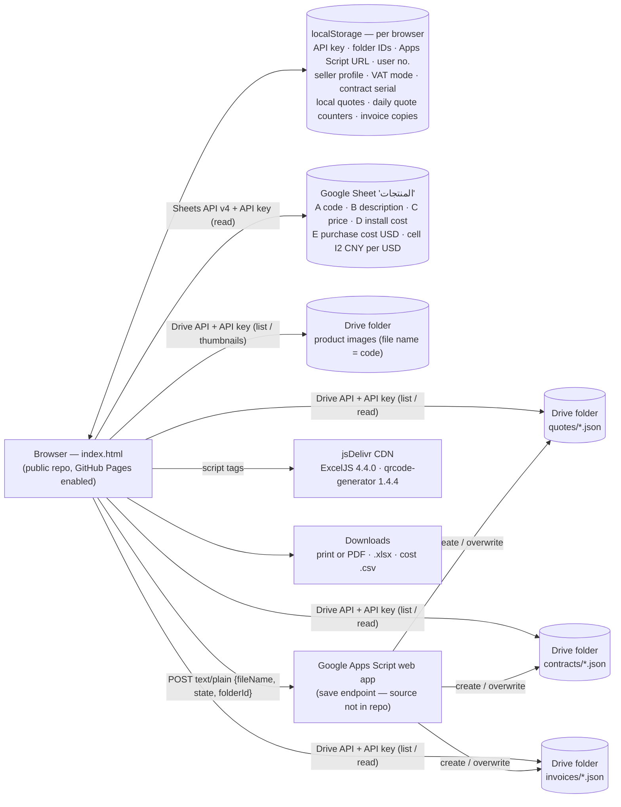

# 01 — Current-State Audit (نظام عروض الأسعار الحالي)

> Scope: `index.html` (3,606 lines, single file; ≈ 58% of its 500 KB are embedded images) on `main` of `mmc-d/quotation` as of 2026-09-26 — 5 commits: the upload of 2026-07-12, then [mmc-d/quotation#1](https://github.com/mmc-d/quotation/pull/1) (ZATCA tax invoices, purchase-cost CSV, options menu — 2026-09-24) and [mmc-d/quotation#2](https://github.com/mmc-d/quotation/pull/2) ("not registered for VAT" mode — 2026-09-25).
> Purpose: capture everything the current tool does so that **no business rule is lost** in the rebuild, and list the risks that must be fixed before or during the migration.

---

## 1. What the app is today

A single-page, Arabic-first (RTL, Tajawal font) **quotation, contract and invoice generator** for **Al-Mada Al-Mubarak for Trading and Smart Solutions (المدى المبارك للتجارة والحلول الذكية)**, head office in Jeddah (Al-Nakheel district). The business it encodes is the supply, installation and programming of **smart-home and intercom systems** (ZigBee/RF smart-home gateways, AC controllers, IP intercoms on PoE switches), with goods bought from Chinese suppliers in CNY. Documents use the company prefix **MMC** (quotes `MMC-…`, contracts `MMCT-…`, invoices `MMC-INV-…`).

It is a static page: the repository is **public** and **GitHub Pages is enabled** on it (per GitHub's repository metadata; the live URL could not be checked from the audit environment). There is no backend of its own: the browser calls Google APIs directly with an API key and writes through a Google Apps Script web app whose source is **not** in this repository.



## 2. Feature inventory (must be preserved or improved)

| # | Area | What it does today | Where (index.html) | Keep / improve in the new platform |
|---|------|-------------------|--------------------|-------------------------------------|
| 1 | Product catalog | Reads the whole sheet via Sheets API; **guesses** the code column (regex) and the description column (longest average text) but reads price, install cost and purchase cost from **fixed columns C, D and E** | `loadSheet()` ~L1261 | Real product master (explicit fields, cost + currency, brand, datasheet, labor, serial-tracked flag). Import the sheet once with an explicit mapping. |
| 2 | Product images | Drive folder; image file name must equal the product code; thumbnails via `drive.google.com/thumbnail` | `loadImages()`, `getImg()` ~L1322 | Object storage with several images/datasheets per product. |
| 3 | Catalog search | Filter by code or description; count; collapsible catalog on phones | `filterCat()`, `renderCat()` | Keep (add brand/category facets, favourites, recent). |
| 4 | Quote header | Client name, company, project, sales rep, quote no., date; strip with CR no., tax card (VAT no.), address, mobile — empty cells are hidden when printing | HTML ~L710–762, `markEmptyCells()` | Pull from a **customer master** (account + contacts + sites) instead of retyping (today the same data is retyped again in the invoice dialog). |
| 5 | Quote numbering | `MMC-{YY}{WW}{DD}{n}` — 2-digit year, ISO week, day of month, then a daily counter without padding (e.g. `MMC-2626221` = 2026, week 26, day 22, quote 1). Next = highest Drive file with today's prefix + 1 (localStorage fallback), computed when the page loads or "+" is pressed; **nothing is reserved** until the quote reaches Drive | `getQuotePrefix()`, `fetchNextQuoteNumber()` ~L2002 | Server-side atomic daily sequence; keep the visible format so numbers continue; add a revision suffix. |
| 6 | Lines | Add product once (no duplicates); qty; editable unit price; original total struck through when the price is lowered; price `0` shows **FREE**; inline-editable description (underlined when modified); drag-and-drop reorder; delete | `addItem()`, `renderQuote()` ~L1468, `updatePrice()` | Keep all; add sections/groups, optional lines, alternatives, per-line discount, internal cost & margin, notes per line. |
| 7 | Installation line (INS) | Auto-computed = Σ(product install cost × qty), always last; user can override (`_manualPrice`) or delete (`_insDeleted` stops auto re-add); manual "add installation" button | `syncInsRow()` ~L1429, `addInsManually()` | Generalise into **labor items** (per labor type: installation / programming / cabling), still printable as one INS line. |
| 8 | Discount | Overall discount as % **or** fixed SAR (mutually exclusive, last typed wins); fixed amount capped at the subtotal; hidden on the printout when 0 | `getDiscountAmount()` ~L1562 | Keep + approval thresholds, margin guardrail, per-line discounts, reason codes. |
| 9 | VAT | 15% toggle on (subtotal − discount); forced off and locked when the company is set as **not VAT-registered** (contract and Excel follow the quote) | `recalc()`, `applyVatMode()` ~L2991 | Tax engine with tax codes; VAT status as a dated **company** setting, not a browser setting. |
| 10 | Notes & terms | Default technical notes (site requirements; ZigBee/RF smart-home devices working without internet; TCP/IP intercom with mobile app; 220 V door panel) and terms (payments 50/40/10; 45–60 working days; prices estimated until the site visit; warranty; **15-day validity**; supply, installation, initial programming and handover) | `DOMContentLoaded` ~L1147–1163 | Template library per product line / project type, validity date field, clause library. |
| 11 | Print / PDF | Browser print, A4 portrait; `@page` footer boxes (page X of Y, company name, phone); logo watermark and page border injected per page; print mirrors for textareas; Times New Roman on paper; **auto-saves to Drive before printing** | `doPrint()` ~L1653, `injectPrintElements()`, `@media print` | Server-side PDF (Chromium) with the same look; **archive every issued PDF** immutably; QR/verification link. |
| 12 | Excel export | ExcelJS: RTL sheet, banner, info grid, item table with product images fetched from Drive, totals | `exportToExcel()` ~L2631 | Keep as an export option; add CSV/XLSX export for every list. |
| 13 | Save / load quotes | The **💾 حفظ button saves only in the current browser** (`localStorage` key `quote_<no>`); the shared Drive archive is written only when printing. Load: search by number, browse by 2-digit user code or `*`, or pick from the browser's local list | `saveQuoteLocally()` ~L1696, `saveQuoteToDrive()` ~L1809, `searchQuoteInDrive()`, `listUserQuotes()` | Database records with status, owner, revisions (R1, R2…), full-text search, filters, list views — no browser-only copies. |
| 14 | Admin navigation | The hard-coded admin user number sees ← → buttons to walk through all Drive quotes | `navigateQuote()` ~L2123 | Replaced by list views, filters and permissions. |
| 15 | Contract generation (admin only) | Builds an editable contract from the current quote: contract no. `MMCT-{serial}`, quote no., date, title «عقد توريد وتركيب» with the project as subtitle (default «نظام الانتركوم والمنزل الذكي»), parties (client from the quote; supplier name, representative, Jeddah – Al-Nakheel address, CR and mobile **hard-coded**), preamble, 8 articles (attachments; specs & price table with editable qty/price/discount; scope; payments 50/40/10 **with amounts in Arabic words (تفقيط)** and an empty bank box typed by hand; 45–60 working-day delivery conditioned on the advance + written approval of specs, door directions, room numbers and design; KSA jurisdiction; 2-year warranty with exclusions + 10-year spare parts; two original copies), signature blocks and the **company stamp image applied automatically** | `openContract()` ~L2151, `ctRecalc()`, `tafqit()` ~L2379 | Contract module with clause library, payment-schedule builder, e-signature, automatic **billing milestones** and **project**; company data and stamp from settings, stamp only on approved contracts. Port `tafqit()` to the server with unit tests. |
| 16 | Contract save / load | Saves the **raw contract HTML** as JSON (`{html, contractNo, quoteNo, savedAt}`); the serial lives in **localStorage** and advances when a save creates a new file | `saveContract()` ~L2505, `loadContractFromDrive()` | Structured contract data + rendered PDF archive; server-side serials. |
| 17 | Tax invoice — ZATCA Phase 1 (since 2026-09-24) | From the current quote: dialog (standard B2B or simplified B2C; buyer prefilled from the quote and validated against ZATCA field rules; supply date; payment means) → draft preview with a provisional number → **issue**: number, ICV, previous invoice number, UUID, Asia/Riyadh timestamp, Hijri date, TLV QR (tags 1–5, BER lengths) → read-only view and reprint. **No** XML, cryptographic stamp, clearance/reporting (Phase 2), credit/debit notes or advance invoices | `openInvoiceDialog()` ~L3113, `previewInvoice()`, `issueInvoice()` ~L3235, `zatcaTlvBase64()` ~L3048 | Tax documents move to **ERPNext + KSA compliance app** (Phase 1F); Core requests them from contract milestones (386/388). Switch the in-app invoice off at ERPNext go-live. |
| 18 | Invoice amounts | Integer halalas; header discount and VAT allocated to the lines by largest remainder so every column adds up and VAT equals the quote's VAT; amount in Arabic words | `computeInvoiceLines()` ~L3092, `allocateHalalas()` | **Reference algorithm** for quote, contract and invoice totals in Core (port with tests). |
| 19 | Invoice numbering & archive | `MMC-INV-{seq:5}` (prefix/start in settings; later invoices follow the latest saved format); next = max(Drive listing, this browser's last issued) + 1; re-checked just before saving, up to 3 attempts; JSON saved to a Drive invoices folder plus a copy in the browser; warns when a same-name file was overwritten | `nextInvoiceNumber()` ~L3350, `finalizeInvoice()`, `storeInvoice()` | ERP naming series seeded from the legacy maximum; ICV and hash chain per EGS unit handled by the ERP. |
| 20 | Issued-invoice register | Search by number or `*` over Drive files and local copies; open read-only; reprint | `searchInvoices()` ~L3419, `openIssuedInvoice()` | Invoice list mirrored from ERPNext with ZATCA status, PDF and payments. |
| 21 | "Not registered for VAT" mode (since 2026-09-25) | Company switch: plain «فاتورة» without VAT, VAT number or QR; quote VAT switch locked off | Settings → بيانات المنشأة, `sellerSnapshot()` | Company tax profile with an effective date (registration date) and audit trail. |
| 22 | Seller profile | Arabic/English name, VAT no. (15 digits, starts and ends with 3), CR, national address (building 4 digits, additional no. 4 digits, street, district, city, postal code 5 digits), phone, e-mail, bank, IBAN, invoice prefix/start — validated, stored **per browser** | `readSellerForm()`, `sellerErrors()` ~L2931 | Company & branch settings with the same validation ([modules/01](modules/01-platform-login-security.md)). |
| 23 | Purchase-cost CSV (admin only) | Per line: USD unit cost (sheet column E) × qty → CNY at the rate in cell I2 and SAR at 3.75; totals; +17% air-freight rows; lists items without a cost; CSV-injection-safe cells | `calculateCost()` ~L2830 | Internal cost & margin on every quote ([CPQ-02](modules/03-quotations-cpq.md#21-catalog--pricebook)), supplier price lists with FX, landed cost ([modules/07](modules/07-inventory-procurement.md)). |
| 24 | Settings | User number, Google API key, sheet ID/name, four Drive folder IDs (images, quotes, contracts, invoices), Apps Script URL, contract serial; admin-only contract buttons | `openSettings()` ~L1178, `saveSettings()` | Real login, roles and a company/branch settings area (no technical IDs for end users). |
| 25 | UX details | In-app confirm dialogs (native `confirm()` is blocked in some embedded browsers), Escape closes overlays, phone layouts for the catalog and the invoice | `appConfirm()` ~L3265 | Keep the patterns in the design system. |

### Business rules embedded in the code (carry over exactly)

1. **Line total** = unit price × qty; subtotal = Σ line totals (INS included).
2. **INS amount** = Σ(installCost × qty) over non-INS lines unless manually overridden or deleted; INS stays the last line.
3. **Discount** applies to the subtotal (before VAT); % and fixed amount are mutually exclusive; the fixed discount is capped at the subtotal.
4. **VAT** = 15% × (subtotal − discount) when enabled; grand total = after-discount + VAT. When the company is set as **not VAT-registered**, no VAT is charged anywhere (quote, contract, Excel, invoice) and invoices carry no VAT number or QR.
5. **Price lowered below list price** → original total shown struck-through (sales transparency on the printout).
6. **Price 0 → "FREE"** on screen and on the printed quote (the contract, Excel and invoice show 0.00).
7. **Payment schedule** (contract): 50% on signing, 40% before the materials are delivered to site, 10% when programming is complete — percentages of the grand total (VAT-inclusive when VAT applies), each spelled out in Arabic words. The quote terms word the triggers as "before shipping" and "after operation and handover". Each part is rounded on its own today, so the three parts can miss the total by 1 halala (≈ 29% of sampled totals); the new engine lets the last milestone absorb the difference.
8. **Delivery clock** of 45–60 working days starts only after (a) the advance is received **and** (b) written final approval of specs, door directions, room numbers and design; nothing is supplied, prepared or installed before that → a natural **project stage gate**.
9. **Warranty — two texts that disagree:** the quote terms promise 12 months on parts and labour plus a second year on parts only; contract article 7 promises 2 years from installation and actual operation, covering manufacturing defects and programming faults, with listed exclusions (misuse, tampering, unauthorised changes, non-compliant electrical connections, normal wear, external factors, power cuts or fluctuations); **spare parts guaranteed for at least 10 years** from supply. The owner must pick one rule; either way the **installed-base registry** needs install dates and separate labour/parts coverage end dates.
10. **Quote validity 15 days** (terms text only — not enforced). Prices are estimates until the site visit; any change of scope changes the price.
11. **Invoices** are issued once and never edited or deleted — corrections only by credit/debit note (stated in the app, not implemented). Invoice lines = quote lines with qty > 0; discount and VAT are allocated to lines in halalas; the issue time is Asia/Riyadh. A standard (B2B) invoice requires the buyer's name, VAT number **or** CR, and full national address; a simplified (B2C) invoice accepts an anonymous buyer but validates whatever is typed. Formats: VAT 15 digits starting and ending with 3; building and additional numbers 4 digits (zero-padded); postal code 5 digits; country code 2 letters.
12. **Invoice numbers** = latest saved + 1 (never below the configured start) and are never reused; prefix and width follow the latest saved invoice.
13. **Purchase cost** (admin): USD unit cost × qty; CNY = USD × the sheet rate; SAR = USD × 3.75; air freight adds 17%; the INS line is excluded (labour, not a purchase).

### Known defects found during the audit

1. "Browse by user number" returns nothing for the current numbering format (it expects `X-YYYY-NNN`); only `*` works — quote numbers no longer contain a user code.
2. The quote-number and contract-search placeholders show `MMC-2026-1`, which is not the format actually generated.
3. With Drive configured, pressing "+" twice before printing yields the same number again; a local save under a number already saved locally silently replaces the older local quote.
4. Printing auto-saves by file name, so a colleague's quote that received the same number on the same day is overwritten; two browsers with the same contract serial produce the same `MMCT-n` and the second save overwrites the first.
5. The contract's bank box is empty and typed by hand, while invoices print the IBAN from the seller settings.
6. `tafqit()` wording needs a linguistic review when ported (e.g., «خمسة عشر ألف» instead of «خمسة عشر ألفاً», «ألفان ريال» instead of «ألفا ريال»).

### Data formats to migrate

Quote file (Drive `quotes/MMC-YYWWDDn.json`, `version: 1`; the 💾 button stores the same JSON in the browser under `quote_<no>`). `invoiceBuyer` is `null` until the invoice dialog has been used for the quote.

```json
{
  "version": 1, "quoteNo": "MMC-2626221", "quoteDate": "2026-06-22",
  "clientName": "", "clientCo": "", "project": "", "salesRep": "",
  "crNumber": "", "taxCard": "", "clientAddress": "", "clientPhone": "",
  "items": [{ "code": "…", "desc": "…", "price": 1500, "unitPrice": 1350, "qty": 2,
              "installCost": 150, "_isAuto": false, "_manualPrice": false,
              "_descModified": false, "_origDesc": "…" }],
  "discountPercent": 0, "discountValue": 0, "discMode": "pct", "vatEnabled": true,
  "techNotes": "…", "terms": "…",
  "invoiceBuyer": { "type": "standard", "name": "", "vat": "", "crn": "", "building": "", "additional": "",
                    "street": "", "district": "", "city": "", "postal": "", "country": "SA", "phone": "",
                    "supplyDate": "", "paymentMeans": "42", "notes": "", "quoteNo": "" },
  "savedAt": "2026-06-22T10:00:00.000Z"
}
```

Contract file (`contracts/MMCT-N.json`): `{ "html": "<div class=\"ct-page\">…", "contractNo": "MMCT-12", "quoteNo": "MMC-…", "savedAt": "…" }` — the contract is stored **only as edited HTML** (each file also embeds the logo and stamp as base64), so totals, parties and payments must be re-extracted during migration (see [05-roadmap.md § Migration](05-roadmap.md#5-data-migration-plan)).

Invoice file (`invoices/MMC-INV-NNNNN.json`; a copy of each invoice issued from a browser is kept there under `zinv_<number>`, and `ginv_last` holds that browser's last number). `type` is `standard`, `simplified` or `plain` (not VAT-registered, then `taxInvoice` is false and there is no `qr`).

```json
{
  "version": 1, "kind": "invoice", "status": "issued", "type": "standard", "taxInvoice": true,
  "quoteNo": "MMC-2626221", "currency": "SAR",
  "seller": { "nameAr": "…", "nameEn": "", "vat": "3…3", "crn": "…", "building": "0000", "additional": "0000",
              "street": "…", "district": "…", "city": "…", "postal": "00000", "country": "SA",
              "phone": "", "email": "", "bank": "", "iban": "", "vatRegistered": true },
  "buyer": { "name": "…", "vat": "", "crn": "…", "building": "…", "additional": "", "street": "…",
             "district": "…", "city": "…", "postal": "…", "country": "SA", "phone": "" },
  "supplyDate": "2026-09-24", "paymentMeans": "42", "notes": "",
  "lines": [{ "code": "…", "name": "…", "qty": 2, "unitPrice": 1350, "gross": 2700, "discount": 0,
              "net": 2700, "vatRate": 15, "vat": 405, "total": 3105 }],
  "totals": { "gross": 2700, "discount": 0, "taxable": 2700, "vat": 405, "total": 3105 },
  "number": "MMC-INV-00001", "icv": 1, "prevNumber": null, "uuid": "…",
  "issueDate": "2026-09-24", "issueTime": "15:04:05", "issuedBy": "…", "savedAt": "…", "qr": "…"
}
```

Product sheet (`المنتجات`): column A part number · B description · C price · D installation fee · E purchase price in USD (derived in the sheet from the supplier's CNY price) · cell I2 = CNY per 1 USD. Header rows are skipped automatically.

Browser-only state — export it from **every** staff browser before any reset or migration: settings (`g*` keys), seller profile and VAT mode (`gseller_info`), local quotes (`quote_*`), daily quote counters (`qnum_*`), contract serial (`gcontract_serial`) and invoice copies (`zinv_*`, `ginv_last`).

---

## 3. Risk assessment

Severity: 🔴 Critical · 🟠 High · 🟡 Medium · ⚪ Low

| # | Sev. | Finding | Impact | Fix (quick win → target) |
|---|------|---------|--------|---------------------------|
| R1 | 🔴 | **Customer data and purchase costs are link-shared.** The tool reads quotes, contracts, invoices and the product sheet with an API key only, which works only when they are shared "anyone with the link" — the app's own hints tell users to share them that way. The public source also contains the default contracts-folder ID. | Client names, mobiles, addresses, CR/VAT numbers, prices, discounts and issued invoices can be reached by anyone holding a link or ID. Purchase costs (column E) and the CNY rate reach every user's browser, so the admin-only cost button protects nothing. PDPL exposure and competitive leakage. | **Now:** share every folder and the sheet with company accounts only; move contracts to a new folder; switch reads to Google sign-in (OAuth) — see Phase 0. **Target:** private database; no direct browser access to storage. |
| R2 | 🟠 | **Public repository with GitHub Pages; personal data and the company stamp are committed.** `index.html` embeds the company stamp image (with the CR number), the representative's full name and mobile number, the admin user number and the contracts-folder ID — in every commit since the first upload. No customer records, API keys or Apps Script URLs are committed. | Anyone can copy the stamp and produce official-looking documents; the representative's personal data is published (PDPL); the admin shortcut and the folder ID are public. | Owner decision (D2): make the repository private; move stamp, representative data, folder IDs and admin rules out of the page; purge them from history. A Pages site stays public even when the repository is private (except GitHub Enterprise Cloud's access-controlled Pages), so serve the tool behind sign-in. |
| R3 | 🟠 | **No authentication.** Identity is a self-typed user number; typing the admin number (visible in the public source) unlocks contracts, navigation over all quotes and the cost calculation; invoices record the typed number as "issued by". | Anyone can impersonate any user or the admin; no accountability for quotes, contracts or tax invoices. | Google sign-in + allow-listed admin accounts (Phase 0) → full identity & RBAC (Phase 1). |
| R4 | 🟠 | **Unauthenticated write endpoint that overwrites by file name.** The Apps Script endpoint receives file name, content and target folder from the browser; its source is not in the repository, so it could not be audited. | Quotes, contracts and **issued invoices** could be overwritten or planted by an outsider; a same-number save silently replaces another record. | Verify a Google ID token; server-side folder allow-list; create-only for invoices and new revisions for quotes/contracts; append-only audit log; numbers issued under `LockService` (Phase 0). |
| R5 | 🟠 | **Tax invoices: Phase 1 only, and their integrity depends on each browser.** No XML, cryptographic stamp, clearance/reporting, credit/debit notes, advance (386) or milestone invoices; number and issue time come from the user's PC; issued invoices are editable JSON files in a link-shared folder; seller data and the VAT switch are per-browser settings. | If VAT-registered: e-invoicing penalties once the company's Phase-2 wave applies (Wave 25 by 1 Feb 2027; earlier waves are already due) and weak Phase-1 controls (no tamper evidence, uncontrolled clock). If not registered: a PC where the switch is off could still charge VAT, which is not allowed. | **Now:** confirm VAT registration and wave (D1); if a wave applies, bridge with a certified invoicing SaaS and stop issuing tax invoices here; make the invoices folder create-only and backed up; one shared company tax profile. **Target:** ERPNext + KSA compliance app (Phase 1F). |
| R6 | 🟠 | **Cross-site scripting (XSS).** The older code paths (catalog, quote lines, Drive and local file lists, contract builder) put sheet data, client fields and file names into `innerHTML` (47 assignments in the file) and inline `onclick` strings without escaping; saved contract HTML is loaded back with `innerHTML`. The invoice code added in Sep 2026 escapes consistently (`escHtml()`). | Tampered data (via R1/R4) could run script in a staff member's browser — e.g., when the admin opens a contract. | Use `escHtml()` for every interpolation, replace inline handlers, sanitize loaded contract HTML with DOMPurify (Phase 0). Target: framework auto-escaping + structured contracts. |
| R7 | 🟡 | **Numbering races and silent overwrites.** Quote numbers come from a Drive listing at page load and are reserved only when the quote reaches Drive (by printing); contract serials live in each browser. | Duplicate `MMC-…` / `MMCT-…` numbers across users and devices; the later save replaces the earlier document with only a toast. | Server-side atomic sequences (Phase 1); until then issue numbers inside the Apps Script under a lock. |
| R8 | 🟡 | **Browser-only data.** The 💾 button saves quotes only in the current browser; settings, the company profile, the contract serial and invoice references also live in `localStorage`. | Quotes that were never printed exist on one PC only and are lost with browser data; PCs drift apart (VAT mode, seller data, serials). | Save to the shared archive; one shared settings file; export every browser before migration. |
| R9 | 🟡 | **No versioning or audit trail** (only Drive revision history); no archive of the PDFs actually sent; contracts stored as edited HTML; the stamp is applied to every generated contract, including drafts. | Disputes on price or scope cannot be settled from the system; a stamped contract can be produced without approval. | Immutable issued-document archive + audit log; stamp applied only after approval (Phase 1). |
| R10 | 🟡 | **Inconsistent and hard-coded terms.** The quote's warranty differs from the contract's; payment-trigger wording differs; supplier identity, representative, phone numbers and VAT rate are hard-coded; the contract's bank box is typed by hand while invoices use the IBAN from settings. | Conflicting commitments to customers; every change needs a code edit. | Owner decides the warranty and payment wording now; company profile & document templates (Phase 1). |
| R11 | ⚪ | Floating-point money in quotes and contracts (`Math.round(x*100)/100`); 50/40/10 parts rounded independently. The invoice path already uses integer halalas. | 1-halala differences between contract parts and totals, and later against ZATCA totals. | Integer-halala arithmetic everywhere; last milestone absorbs rounding. |
| R12 | ⚪ | Heuristic sheet parsing (code and description columns guessed; price, install cost and cost at fixed columns C/D/E; rate in I2). | A column added or moved in the sheet silently changes prices or costs. | Explicit product schema. |
| R13 | ⚪ | Third-party scripts from jsDelivr (ExcelJS 4.4.0, qrcode-generator 1.4.4) without Subresource Integrity; no Content-Security-Policy; issuing a tax invoice depends on the QR script loading. | Supply-chain risk; invoicing is blocked when the CDN is unreachable. | Add SRI + CSP now; bundle dependencies in the new platform. |
| R14 | ⚪ | Maintainability: 3,606-line single file (≈ 58% of its 500 KB is base64 images — the logo twice, the riyal symbol 24 times, the stamp once), HTML built in template strings, no tests, no build. | Every change risks regressions; slow first load on phones. | New modular codebase with tests and CI (Phase 1). |

## 4. Gap analysis vs. an ERP + CRM + accounting platform

| Capability | Today | Gap |
|-----------|-------|-----|
| Login, users, roles | ❌ self-typed number; admin number in the public source | Real identity, MFA, roles, record-level permissions, audit |
| Customer master (CRM) | ❌ retyped per quote, and again in the invoice dialog | Accounts, contacts, sites, dedup, history, 360° view |
| Leads & pipeline | ❌ | Lead capture (WhatsApp, forms, referrals), stages, follow-ups, forecasting |
| Quote lifecycle | Partial (create/print/save; drafts kept in the browser) | Status (draft → sent → accepted/lost), revisions, approvals, validity, e-acceptance, win/loss reasons |
| Contracts | Partial (HTML generator, admin only) | Clause library, e-signature, milestones → billing, repository |
| Invoicing + ZATCA Phase 2 | Partial — Phase-1 tax/simplified invoices or plain invoices for a whole quote (since Sep 2026) | Phase 2 (XML, cryptographic stamp, clearance/reporting), credit/debit notes, 386 advance and milestone invoices, company-controlled numbering and clock |
| Payments & receivables | ❌ | Receipts, payment links (mada/Apple Pay), statements, aging, reminders |
| Projects / installation tracking | ❌ | Templates, stage gates, tasks, Gantt, site survey, snag list, handover, profitability |
| Field service | ❌ | Work orders, scheduling, technician mobile app, checklists, signatures |
| Installed base & warranty | ❌ | Device registry (serial/MAC/IP/firmware), labour and parts warranty dates, 10-year spare-parts horizon, RMA, AMC |
| Procurement & inventory | Partial — purchase-cost CSV from the sheet (USD/CNY/SAR, +17% air freight) | Suppliers, PR/RFQ/PO, receiving, warehouses, serials, landed costs, valuation |
| General ledger & finance | ❌ | Chart of accounts, journals, AP, bank reconciliation, VAT return, statements |
| HR & payroll | ❌ | Employees, iqama/document expiry, attendance, leave, payroll (GOSI, WPS), EOSB, commissions |
| Reports & dashboards | ❌ | Sales, pipeline, margins, projects, cash, stock, service KPIs |
| Notifications & messaging | ❌ | WhatsApp/SMS/email templates, reminders, customer updates |
| Customer portal | ❌ | Online quote acceptance, invoices, payments, project progress, tickets |
| IoT-connected service | ❌ | Device health from ThingsBoard → automatic tickets (the company's "smart solutions" differentiator) |

## 5. Phase 0 — immediate hardening of the current app (1–2 weeks)

These keep the current tool safe while the new platform is being built:

1. **Stop public exposure (R1, R2):** share the quotes, contracts and invoices folders and the product sheet with company accounts only (move the contracts to a new folder, because the old folder ID is public); replace API-key reads with Google Identity Services (OAuth "Sign in with Google", `drive.readonly`/`drive.file` scopes); make the repository private, move the stamp, the representative's details, folder IDs and the admin rule out of `index.html`, and purge them from git history (D2); serve the tool behind sign-in instead of public GitHub Pages. The only company account visible in the repository is a consumer Gmail address: if there is no Google Workspace domain, allow-list the invited Google accounts.
2. **Real identity for admin features (R3):** derive the user from the Google account; admin = allow-listed accounts, not a typed number. Keep the numeric user code only as a label.
3. **Protect the save endpoint (R4, R7):** the Apps Script verifies the Google ID token, only writes to allow-listed folders, never overwrites in the invoices folder, keeps new revisions for quotes and contracts, issues quote/contract/invoice numbers under `LockService`, and appends every write to an audit sheet.
4. **One shared source of truth (R8):** make 💾 save to the shared archive; move settings, the company profile and the VAT mode into one shared settings file read at start-up, so every PC issues identical documents.
5. **XSS (R6):** use the existing `escHtml()` in every template literal that interpolates data; sanitize contract HTML with DOMPurify on load; add CSP + SRI (R13).
6. **Key hygiene:** restrict the API key by referrer and API; rotate it after the OAuth switch.
7. **Tax status (R5):** confirm on the FATOORA portal whether the company is VAT-registered and which e-invoicing wave applies; set the VAT mode centrally; if a Phase-2 wave applies, start the certified bridge now (D1) and stop issuing tax invoices from this tool.
8. **Terms (R10):** the owner decides the warranty (quote vs contract) and the payment-trigger wording; align the quote terms and contract article 7.
9. **Back up everything:** export all quote, contract and invoice JSON files, every browser's local data (quotes, invoice copies, settings), the product sheet and images to a dated archive — this becomes the input for migration.

> Phase 0 is intentionally minimal: no new features, only risk reduction, one set of company settings and a clean data export for the migration.

### Phase 0 status (as of 2026-10-05, branch `claude/new-session-l6y9qi`)

Code-only; the owner actions below are listed in full in [`phase-0-owner-checklist.md`](phase-0-owner-checklist.md) and were not attempted here.

| # | Item | Status | Commit |
|---|------|--------|--------|
| 1 | XSS — `escHtml()` everywhere, `data-*` instead of inline `onclick` with data, DOMPurify on loaded contracts (R6) | ✅ Done | `a8392e6` |
| 2 | SRI on the three CDN scripts (`qrcode.js`, not the unpinnable `qrcode.min.js`) + a CSP `<meta>` (R13) | ✅ Done | `a994a4c` |
| 3 | Stamp image, representative's name/mobile, default contracts-folder ID, hard-coded `ADMIN_USER_ID` taken out of `index.html`, replaced by shared settings + an admin allow-list (R2, part of D2) | ✅ Done in code. ⬜ Needs owner: the equivalent data in **git history** (every commit since the first upload) is unchanged — purging it is an owner action (history rewrite + force-push) | `174dceb` |
| 4 | Shared `settings.json` in Drive, admin-publishable (R8, R10) | ✅ Done in code. ⬜ Needs owner: nobody has published one yet — every browser still runs on its own local settings until an admin does | `a9f2b9e` |
| 5 | 💾 saves to the shared Drive archive too; server-reserved quote/contract numbers with a labelled offline fallback; invoice number + Asia/Riyadh time from the server, no fallback; browse by date/sales rep; "export all local data" (R7, R8, defects) | ✅ Done in code. ⬜ Needs owner: invoice issuance and server-side numbering need item 7 deployed first (until then they fall back to today's client-side behaviour, or — for invoices — simply refuse) | `374e49a` |
| 6 | Google sign-in behind `googleClientId`; OAuth read instead of the API key when signed in (R3) | ✅ Done in code, opt-in. ⬜ Needs owner: create the OAuth client ID and decide the consent-screen path (Testing/External vs. Workspace) before turning it on | `361b342` |
| 7 | Hardened Apps Script (`apps-script/Code.gs` + README) — folder allow-list, filename validation, create-only invoices, `_history` on overwrite, numbering lock, optional ID-token check, optional audit log (R4) | ✅ Written and unit-tested against the Playwright mock. ⬜ Needs owner: **deploy it** — items 4-6 above call actions (`nextNumber`, `saveSettings`) that do not exist in whatever Apps Script is live today | `9e5e919` |
| — | Validation: Playwright suite (27 tests) mocking every Google/Apps Script endpoint, incl. a parity check of totals/tafqit/invoice lines against `main`'s original `index.html` | ✅ All 27 pass | `6efd6f4` |
| — | Owner-only actions (repo private + history purge, Drive sharing, API key restriction, OAuth client, Apps Script deployment, settings.json publish, VAT/ZATCA confirmation, warranty wording, local-data export on every browser) | ⬜ Not attempted — out of scope for this session by design | see checklist |

No finding above was removed from §3 — R2's git-history exposure and R4's "not yet deployed" state are **not** resolved by this branch alone; they need the owner actions above.
