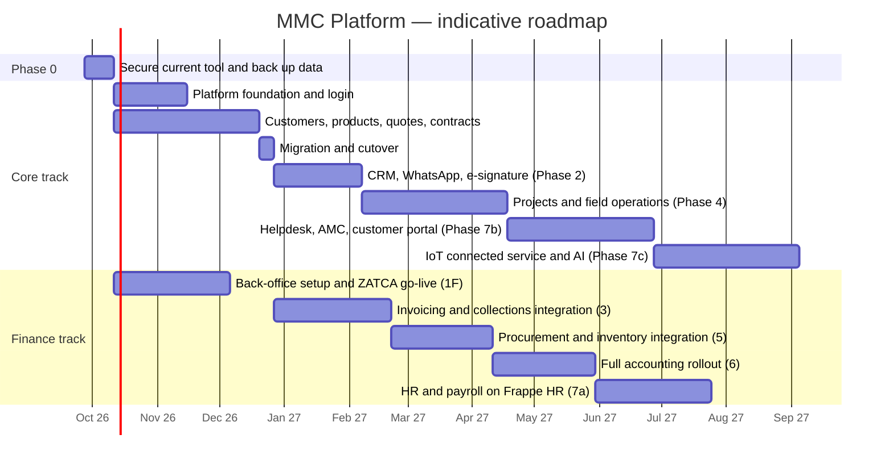

# 05 — Roadmap, Migration & Delivery Plan (خارطة الطريق)

> Indicative plan for a small core team (see §6). Dates assume a start on **Sunday 27 Sep 2026** and a Sun–Thu working week. Every phase ends with something the business uses in production — no "big bang".

## 1. Delivery strategy

1. **Strangler replacement.** MMC Core replaces the current `index.html` tool module by module. The old tool stays **read-only** after cutover (for look-ups) and is then retired.
2. **Value first, compliance never late.** Order is driven by (a) daily pain (quotes/contracts), (b) cash and legal exposure (invoicing, ZATCA), (c) operational control (projects, stock), (d) back-office depth (GL, payroll), (e) differentiation (service, IoT, AI).
3. **Two tracks.** A **Core track** (developers: foundation, sales, CRM, projects, service) and a **Finance track** (ERPNext implementer + accountant: back-office setup, then invoicing, purchasing/stock and full accounting integration). The Finance track starts in week 3 because it is mostly configuration.
4. **Compliance comes from the back office, early.** ERPNext with the KSA compliance app is configured and onboarded to ZATCA (simulation → production) during Phase 1F, so tax invoices can be issued compliantly **directly in ERPNext by December 2026** — before the Core integration of Phase 3 automates them.
5. **ZATCA deadlines.** Wave 24 (taxable revenue > SAR 375k) had to integrate by **30 Jun 2026**; Wave 25 (> SAR 187.5k) must integrate by **1 Feb 2027**. The current tool issues Phase-1 invoices only (or plain invoices in its "not registered for VAT" mode). First confirm whether the company is VAT-registered: if it is and is not already issuing Phase-2–integrated invoices, subscribe to a certified invoicing SaaS **now** as a bridge until ERPNext goes live (D1); if it is not, it must register once taxable supplies exceed SAR 375k in 12 months (voluntary above SAR 187.5k), and Phase 1 then applies from registration.
6. **Decision gates.** At the end of Phases 1, 3 and 6 the owner re-confirms scope, budget and build-vs-integrate choices.

## 2. Phases at a glance

| Phase | Name | Duration | Main outcomes | Exit criteria |
|------|------|---------|---------------|---------------|
| **0** | Secure & back up | 2 wks | Current tool no longer exposes customer data; stamp and personal data out of the public page and history; real Google sign-in for admin features; one shared company profile; full data export incl. browser-only quotes; VAT & ZATCA status confirmed | No public folder or sheet access; repository private; XSS fixes merged; backup archive verified |
| **1** | Foundation + Sales core (Core track) | 10–11 wks | MMC Core live: **login page**, users/roles, company settings, customers, products, **Quotations v2**, **Contracts v2**, PDF archive, dashboards v1, migration of legacy data | All sales users quote only in MMC Core for 2 consecutive weeks; old tool read-only |
| **1F** | Back-office setup (Finance track, parallel) | 8 wks | ERPNext + KSA compliance app + Frappe HR installed in Dammam; chart of accounts, taxes, branches, EGS units onboarded (simulation → production); customers/items synced; opening balances | Accountant issues compliant 386/388/381 invoices directly in ERPNext; bridge SaaS (if any) retired |
| **2** | CRM & engagement | 6 wks | Leads (WhatsApp, forms, referrals, ads), pipeline, activities, follow-up automation, online quote acceptance, Nafath e-signature | 100% of new leads captured; weekly pipeline review run from the dashboard |
| **3** | Invoicing & collections integration | 8 wks (parallel to 2) | Billing milestones → payment requests → payment links → 386/388 created in ERPNext automatically; ZATCA status/QR/PDF mirrored; statements, AR aging, WhatsApp reminders | ≥ 99% invoices cleared/reported first time; one month of AR run end-to-end from Core |
| **4** | Projects & field operations | 10 wks | **Project tracking** with stage gates and delivery clock, tasks/Gantt, client approvals, site surveys, work orders, technician PWA, installed-base registration, handover & warranty start, service-call intake | All active projects tracked; every installed device registered with serial + warranty dates |
| **5** | Procurement & inventory integration | 7 wks | Material requests from project BOQ → ERPNext RFQ/PO/receipt/bill; serial/MAC capture; van & project-site stock; landed costs; availability & valuation in Core; technician consumption posted to stock | First cycle count ≥ 98% accurate; all purchases through POs |
| **6** | Full accounting rollout | 7 wks | Bank reconciliation, cheques/PDC, expenses & petty cash, fixed assets, cost centers & **project P&L**, budgets, VAT return, statements, period close; finance dashboards in Core | Month-end close ≤ 5 working days; VAT return from the system matches the filed return |
| **7** | People, service & intelligence | 16–20 wks | Frappe HR payroll + KSA extension, helpdesk & AMC, **customer portal**, **IoT-connected service** (ThingsBoard), advanced BI, AI assistants | Payroll/WPS run for 2 months; tickets & SLAs live; IoT alarms creating tickets for pilot sites |

## 3. Timeline

> Capacity notes: Ramadan 2027 (≈ Feb–Mar 2027) and the Eid holidays reduce throughput — plan releases around them. With only two developers, run Phases 2 → 3 → 4 sequentially (≈ +2–3 months); the Finance track depends mostly on the implementer and accountant, not on the developers.

## 4. Phase details

### Phase 0 — Secure & back up (2 weeks)
- Apply the quick wins in [01-current-state.md §5](01-current-state.md#5-phase-0--immediate-hardening-of-the-current-app-12-weeks): company-only sharing of the quotes/contracts/invoices folders and the product sheet + Google sign-in, admin by account allow-list, token-checked create-only Apps Script with numbers issued under a lock, HTML escaping + DOMPurify, CSP/SRI, restricted API key, one shared settings file (company profile, VAT mode).
- Owner actions (D2): make the repository private, remove the stamp, the representative's details, the folder ID and the admin number from `index.html`, purge them from history, and move the tool off public GitHub Pages.
- Confirm VAT registration and the ZATCA wave on the FATOORA portal; start a certified bridge if registered and not compliant (D1).
- Owner decides the warranty wording (quote terms vs contract article 7) and the payment-trigger wording.
- Export every quote/contract/invoice JSON, each staff browser's local data, the product sheet and all product images into a dated archive (input for §5).

### Phase 1 — Foundation + Sales core (10–11 weeks, Core track)
| Workstream | Scope (see module specs) |
|-----------|--------------------------|
| Platform | Monorepo, CI/CD, staging/production in Google Cloud Dammam, database & migrations, **login page** (Google sign-in, passkeys, TOTP for privileged roles, e-mail/password fallback), invitations, roles & permissions, audit log, company/branch settings, numbering series, file storage, PDF engine, e-mail + WhatsApp send, company calendar, Arabic/English UI shell — [modules/01](modules/01-platform-login-security.md) |
| Master data | Customers (party, contacts, sites, unified number/VAT/national address), products (import from the sheet: code, bilingual description, price, install cost, USD purchase cost, images), categories, brands, price lists; sync to ERPNext — [modules/02](modules/02-crm.md), [modules/03](modules/03-quotations-cpq.md) |
| Quotations v2 | Full parity with today (INS auto line, FREE, strike-through, discount %/amount, VAT incl. the not-registered mode, notes/terms, A4 PDF, Excel, internal purchase cost) **plus** sections, optional lines, packages, statuses, revisions, validity, discount/margin approvals, send by WhatsApp/e-mail, list views, archive of issued PDFs — [modules/03](modules/03-quotations-cpq.md) |
| Contracts v2 | Generated from the accepted quote, 3–4 templates, payment-schedule builder (default 50/40/10), tafqit, company data and stamp from settings (stamp only on approved contracts), issued PDF archive — [modules/04](modules/04-contracts-esign.md) |
| Reporting v1 | CEO cockpit (first tiles), quote register, win rate, discount & margin analysis — [modules/10](modules/10-reports-bi.md) |
| Migration | Products, legacy quotes & contracts, numbering continuity (§5) |
| Spikes | ERPNext KSA-app capability check (386 + `PrepaidAmount`, EGS per branch, webhooks); Gotenberg Arabic font/searchability test; Cloud Run vs GKE availability in `me-central2` |

### Phase 1F — Back-office setup (8 weeks, Finance track, parallel)
ERPNext v15+ with the KSA compliance app and Frappe HR deployed in Dammam (staging + production); bilingual chart of accounts (IFRS-for-SMEs as endorsed by SOCPA) with VAT, import-VAT, reverse-charge, customer-advance, retention, PDC, WHT and GOSI accounts; tax templates with ZATCA categories/exemption codes; the Jeddah head office (plus any branch confirmed under D9) with **one EGS unit per branch** onboarded (simulation → production); invoice print formats (Arabic/English with QR); integration users & API keys; customers/items seeded from Core; opening balances and open AR/AP; accountant trained. From this point **tax invoices are issued compliantly in ERPNext** and the old tool's invoice feature is switched off (its issued invoices stay in the archive) — [modules/08](modules/08-accounting-zatca.md).

### Phase 2 — CRM & engagement (6 weeks)
Leads (web form, WhatsApp Cloud API inbound, Meta/Snapchat/TikTok lead ads, referrals), kanban pipelines, opportunities, activities & reminders, shared WhatsApp inbox with approved templates (BSUID-aware), Google Workspace e-mail/calendar sync, follow-up automations (unviewed quote, expiring quote, stale deal), lost reasons, targets, CRM dashboards, Wathq CR and national-address lookup, **online quote view & OTP acceptance**, **Nafath e-signature** for contracts — [modules/02](modules/02-crm.md), [modules/11](modules/11-portal-messaging.md).

### Phase 3 — Invoicing & collections integration (8 weeks)
Billing milestones drive **payment requests** (non-tax) with payment links (mada/Apple Pay); on receipt Core records the payment and requests the **386** prepayment invoice in ERPNext; the final milestone requests the **388** with advances deducted; credit/debit-note requests; ERPNext webhooks mirror number, UUID, ZATCA status, QR and PDF into Core; customer statements, AR aging, WhatsApp/e-mail reminders; nightly sync reconciliation — [modules/08](modules/08-accounting-zatca.md).

### Phase 4 — Projects & field operations (10 weeks)
Project templates by type, **stage gates** (advance received ∧ client approvals of specs/door directions/room numbers/design), **delivery clock** in working days, tasks & timeline/Gantt, client approvals & submittals, site-survey forms, work orders & dispatch board, **technician PWA** (checklists, photos, customer signature, GPS check-in, serial/MAC scanning, outbox for weak signal), installed-base registry, snag list, commissioning test sheets (incl. fire-alarm release of maglocks), handover package & acceptance certificate, warranty start, **warranty service-call intake** (WhatsApp/phone → ticket → work order with automatic coverage check), timesheets — [modules/05](modules/05-projects.md), [modules/06](modules/06-field-service-assets.md).

### Phase 5 — Procurement & inventory integration (7 weeks)
Material requests generated from the signed contract BOQ minus reserved stock → ERPNext RFQ/supplier quotations/PO (approval limits, deposits, Incoterms, multi-currency) → import shipment record (B/L, containers, ETA, FASAH declaration, SABER/CST documents) → purchase receipt with bulk serial/MAC import → landed cost voucher → purchase invoice (3-way match; supplier ZATCA XML attached). Landed cost replaces today's rule of thumb (+17% for air freight on the CNY → USD → SAR cost). Warehouses for the Jeddah store, technician vans and project sites (one store per extra branch if D9 adds one); reservations when the advance is received; technician consumption and returns posted from work orders; availability, projected quantity and valuation shown in Core; compliance-certificate warnings — [modules/07](modules/07-inventory-procurement.md).

### Phase 6 — Full accounting rollout (7 weeks)
Bank accounts and reconciliation (statement import first, open-banking feeds later), post-dated cheque register, petty cash/custody and expense claims, fixed assets & depreciation, cost centers & **project P&L**, budgets, period locks & year-end, VAT return, withholding tax, FX revaluation, trial balance/P&L/balance sheet/cash flow, auditor access; finance KPIs (cash, AR/AP aging, DSO, project margin) in Core dashboards — [modules/08](modules/08-accounting-zatca.md).

### Phase 7 — People, service & intelligence (16–20 weeks, can overlap)
- **7a HR & payroll** — Frappe HR with the `mmc_ksa` extension: employee master with iqama/passport/insurance expiry alerts, Qiwa contract status, leave per the amended Labor Law, payroll with dated GOSI/SANED rates, Mudad salary file, EOSB/final settlement, loans, self-service; Core supplies geofenced site attendance, commissions (paid on collection) and technician incentives; Saudization dashboard (sales 60%, engineering 30%) — [modules/09](modules/09-hr-payroll.md).
- **7b Service** — helpdesk (WhatsApp/portal/e-mail), SLAs, AMC contracts with preventive visits and recurring invoices, RMA, **customer portal** (devices, warranty, invoices, payments, tickets) — [modules/06](modules/06-field-service-assets.md), [modules/11](modules/11-portal-messaging.md).
- **7c IoT & AI** — ThingsBoard integration (device health, alarms → tickets, customer dashboards), AI quote-from-BOQ, WhatsApp assistant (business-specific, per Meta policy), natural-language reports, MCP server for the team's AI assistants — [modules/12](modules/12-iot-ai.md).

## 5. Data migration plan

| Source | Target | Method | Validation |
|--------|--------|--------|-----------|
| Product sheet (`المنتجات`) | Core `product`, `price_list_item` → ERPNext *Item* | One-off import with an **explicit column mapping** (A code, B description, C price, D install cost, E purchase cost in USD; cell I2 as the first CNY/USD rate) — no heuristics; bilingual descriptions split where possible; `installCost` → `install_labor_cost` | Row counts; 20 random products checked by sales; price and cost totals equal |
| Drive product images | Cloud Storage, `attachment` | Match file name = product code | Report of products without images |
| Quote JSON (`version: 1`) from Drive **and** from every staff browser (`quote_*` keys) | `party` (deduplicated), `contact`, `site`, `quote`, `quote_line` | Script: merge Drive and browser copies (latest `savedAt` wins, conflicts listed); normalise phone numbers (+966), dedupe customers by unified number/CR → VAT → phone → normalised Arabic name; `invoiceBuyer` blocks add national addresses; keep original numbers; status `legacy-sent`; store original JSON in `legacy_json`; recompute totals with the **same rules** and flag any difference | 100% files imported or listed in an exceptions report; recomputed grand totals match stored state |
| Contract JSON (`html`) | `contract`, `billing_milestone`, `issued_document` | Sanitize HTML → archive as legacy PDF; extract contract no., quote no., totals and payment amounts; link to quote | Every contract linked to a quote or listed as orphan; amounts match PDF |
| Invoice JSON (`MMC-INV-…` in Drive + browser copies `zinv_*`) | Immutable legacy archive + Core `issued_document`; open balances → ERPNext AR | Keep each issued invoice unchanged (JSON + PDF rendering) for the statutory retention period; link it to its customer and quote; import only unpaid balances as opening AR in Phase 1F; never re-issue or re-submit legacy invoices | Count and totals equal the archive; VAT per period matches the returns filed |
| Company profile (`gseller_info` in each browser) | `company`, `branch` settings | Take the most complete profile, verify it against the CR and VAT certificates; record the VAT status with its effective date | Owner sign-off |
| Numbering | `numbering_series` | Quotes continue the daily `MMC-{YY}{WW}{DD}{n}` series (today's counter seeded from the existing maximum); contract serial from max(`MMCT-n`) + 1; ERPNext invoice naming series from max(`MMC-INV-n`) + 1 (the Phase-2 ICV and hash chain are kept per EGS unit by the ERP) | First new numbers reviewed before go-live |
| Users | `app_user` (+ ERPNext users for back-office roles) | Invite by e-mail; keep the legacy user number as a label | Every former user number mapped |
| Opening balances, open AR/AP, fixed assets, stock on hand | ERPNext | Accountant-prepared templates imported in Phase 1F (balances) and Phase 5 (stock count) | Trial balance equals the closing balance of the previous system/accountant |

**Cutover:** freeze → final export (Drive **and** every staff browser) → import → reconciliation report signed by the sales lead → switch the old tool's hosting (GitHub Pages or its Phase-0 replacement) to a read-only page linking to MMC Core → keep the Drive archive untouched (company-only, read-only) for audit and tax-record retention.
**Rollback:** until the exit criteria are met, the old tool can be re-enabled (it still reads the Drive archive).

## 6. Team & resourcing

| Role | Phase 0–1 / 1F | Phases 2–6 | Phase 7 | Notes |
|------|---------------|-----------|---------|-------|
| Product owner (founder) | 0.3 | 0.3 | 0.2 | Priorities, acceptance, domain rules |
| Tech lead / architect (senior full-stack) | 1.0 | 1.0 | 1.0 | Architecture, security, code review, DevOps on managed services, back-office port |
| Full-stack developers | 1.0 | 2.0 | 2.0 | TypeScript; one owns the ERP connector |
| ERPNext / Frappe implementer (contract) | 0.6 | 0.3 | 0.3 | Back-office setup, KSA app, `mmc_ksa` extension, upgrades |
| UI/UX designer (Arabic RTL) | 0.5 | 0.2 | 0.2 | Design system, document templates, mobile flows |
| QA engineer | 0.5 | 1.0 | 1.0 | Playwright, ZATCA scenario pack, sync reconciliation tests |
| Accountant / tax advisor (external) | 8 h/week in 1F | 4 h/week in 3 and 6 | as needed | Chart of accounts, VAT/ZATCA review, UAT |
| HR/payroll advisor (external) | — | — | 4 h/week in 7a | Labor law, GOSI, WPS validation |

**Effort estimate (person-months, excluding the owner):** Phase 0 ≈ 0.5 · Phase 1 ≈ 9 · Phase 1F ≈ 3 · Phase 2 ≈ 4 · Phase 3 ≈ 4 · Phase 4 ≈ 8 · Phase 5 ≈ 4 · Phase 6 ≈ 3 · Phase 7 ≈ 12 → **≈ 47–50 person-months** for the full scope (≈ 10 fewer than building the ledger, ZATCA signer, stock valuation and payroll in-house). Multiply by your blended monthly rates for the budget.

**AI-assisted development** (already how the current tool was built): keep a `CLAUDE.md` with conventions, strict TypeScript, generated API clients, and tests for every business rule so AI-written code is verified automatically. Humans own tax/accounting configuration, security reviews and releases.

### Running costs (orders of magnitude, confirm with quotes)
- Google Cloud Dammam for Core (containers, Cloud SQL HA with backups, storage, monitoring) and the ERPNext stack (VMs/containers, MariaDB, Redis, backups), production + staging: typically a few hundred USD/month at this scale.
- Messaging: WhatsApp Business Platform per-message fees by template category (marketing ≈ 4–5× utility in KSA) and, **from 1 Oct 2026**, service messages beyond the free monthly allowance; SMS per message; transactional e-mail.
- Payment gateway: per-transaction fees (mada cheaper than credit cards).
- E-signature (Nafath via a licensed TSP): per signature or subscription.
- ERPNext implementer / optional paid support for the KSA compliance app.
- Optional SaaS during transition: ZATCA-certified invoicing bridge (D1).

## 7. Engineering process

- **Cadence:** 2-week sprints; demo to the owner every sprint; production release at least every sprint behind feature flags.
- **Definition of Done:** code reviewed, unit tests for domain rules (money, tax preview, tafqit, numbering, labor calc, calendars), API tests, Playwright E2E for the main flows (quote → contract → payment request → invoice mirror), Arabic & English strings, RTL checked, audit events emitted, permissions enforced server-side, docs updated.
- **Environments:** local → preview (per PR) → staging (Core + ERPNext on ZATCA *simulation*) → production (ZATCA *core*).
- **Quality gates in CI:** type-check, lint, tests, migrations dry-run, dependency & secret scanning, SBOM; contract tests for the ERPNext connector against a pinned staging ERPNext.
- **Back-office changes:** ERPNext and KSA-app versions pinned; upgrades tested in staging with the ZATCA scenario pack before production.
- **Architecture Decision Records** for every significant choice (see [03-target-architecture.md §14](03-target-architecture.md#14-architecture-decision-records)).

## 8. Change management & training
- Name a **champion** per department (sales, projects, finance, stores) who tests every sprint in staging.
- Arabic video walkthroughs (2–3 min per task) and a one-page cheat sheet per role.
- Parallel run for every cutover (old tool read-only, not both editable).
- Track adoption weekly (logins, documents created per user) and fix friction fast.

## 9. KPIs

| Area | KPI | Target |
|------|-----|--------|
| Adoption | Quotes created in MMC Core | 100% by end of Phase 1 |
| Data quality | B2B customers with unified number, VAT and national address | ≥ 95% |
| Sales | Quote turnaround (request → sent) | < 24 h |
| Sales | Win rate & average discount visible per rep / product line | 100% of quotes |
| Finance | Invoices cleared/reported by ZATCA on first attempt | ≥ 99% |
| Finance | DSO (days sales outstanding) | −20% within 6 months of Phase 3 |
| Finance | Month-end close | ≤ 5 working days |
| Integration | Unresolved Core ↔ ERPNext sync drift older than 24 h | 0 |
| Projects | Projects delivered within the contractual window | ≥ 90% |
| Projects | Devices registered with serial + warranty at handover | 100% |
| Service | First-time-fix rate | ≥ 85% |
| Service | Tickets resolved within SLA | ≥ 90% |
| Inventory | Stock accuracy at cycle count | ≥ 98% |
| Growth | Recurring revenue share (AMC + monitoring) | Tracked from Phase 7; target set at the Phase 6 gate |
| Platform | Availability / p95 page load | ≥ 99.5% / < 2 s |

## 10. Risk register

| # | Risk | L | I | Mitigation |
|---|------|---|---|-----------|
| 1 | Scope creep ("full ERP" everywhere at once) | H | H | Phase gates, P0/P1/P2 discipline, owner signs scope per phase |
| 2 | ZATCA non-compliance before go-live (VAT registration unconfirmed; today's in-app invoices are Phase 1 only; Wave 24 passed; Wave 25 due 1 Feb 2027) | M | H | Confirm registration and wave in Phase 0; certified bridge if needed; ERPNext compliant invoicing by Dec 2026 (Phase 1F); old tool stops issuing invoices at go-live |
| 3 | KSA compliance app lacks a scenario (e.g., 386 prepayment deduction) | M | H | Phase 1 spike; contribute the gap or route through a certified middleware API behind the port |
| 4 | Core ↔ ERPNext sync drift or duplicate documents | M | H | Single owner per field, idempotency keys, inbox/outbox, nightly reconciliation with alerts, no manual edits of mirrored data |
| 5 | Two-stack operating burden (TypeScript + Frappe) | M | M | Managed Cloud SQL, containerised ERPNext, implementer on retainer, pinned versions, runbooks |
| 6 | Customer-data breach (PDPL) | M | H | Phase 0 fixes, MFA/passkeys, RLS, column encryption, audit, least privilege, pen-test before Phase 3 go-live |
| 7 | Key-person dependency (founder / tech lead) | H | H | ADRs, documentation, code reviews, second developer on every module |
| 8 | Low adoption by sales/technicians | M | H | Parity-first quote editor (same speed as today), mobile-first technician flows, champions |
| 9 | Migration data quality (duplicate customers, missing unified number/VAT) | H | M | Dedup rules, exceptions report, data-cleaning sprint before cutover |
| 10 | Arabic PDF rendering / non-searchable text | M | M | Server-side Chromium, font test in Phase 1 spike, visual regression tests |
| 11 | WhatsApp cost increase (service messages billable from 1 Oct 2026) and policy (general-purpose AI bots banned since 15 Jan 2026) | H | M | Utility-only templates for operations, cost ledger & budgets, business-specific bot scope only |
| 12 | Saudization: 60% Saudi sales staff (from 19 Apr 2026, ≥ 3 sales staff) and 30% engineers; GOSI rates stepping up each July to 2028 | H | M | HR dashboard + hiring plan; commission plans designed for Saudi reps' minimum fixed pay; dated rate tables |
| 13 | Offline sync conflicts in the technician app | M | M | Narrow offline scope (jobs, checklists, photos), server-wins rules + conflict log |
| 14 | Regulatory change (ZATCA specs, labor law, camera law, fire code) | M | M | Rules as configuration, official-source monitoring, legal review of templates |
| 15 | Under-estimated effort | M | M | Re-plan at each gate; cut P2 items first |
| 16 | Browser-only data lost before migration (quotes saved only locally, local invoice copies, per-PC settings) | M | M | Phase 0 export from every staff browser; "save" writes to the shared archive; one shared settings file |

## 11. Decision log — recommended answers adopted (2026-09-25)

The owner asked to proceed with every recommended answer. These are now the working assumptions of the plan; any of them can be revisited at a phase gate.

| # | Question | Decision adopted | Consequence in the plan |
|---|----------|------------------|-------------------------|
| D1 | Which system issues tax invoices today? | Keep it **only if** it is ZATCA Phase-2 integrated; otherwise subscribe to a ZATCA-certified invoicing SaaS **now** as a bridge. *This repository:* the current tool itself issues Phase-1 invoices (QR tags 1–5) or plain invoices when set as not VAT-registered — so confirm VAT registration first; the bridge is needed as soon as the company is registered and its wave applies | Bridge retired when ERPNext invoicing goes live (end of Phase 1F, ≈ Dec 2026); the tool's invoice feature is switched off then |
| D2 | Repository visibility and committed personal data | Make the repository **private**; take the company stamp, the representative's name and mobile, the contracts-folder ID and the admin number out of `index.html` and purge them from git history; move the old tool to access-controlled hosting (GitHub Pages from a private repository needs a paid plan and the site itself stays public unless GitHub Enterprise Cloud access control is used). No customer records are committed in this repository | Owner action in Phase 0 (history rewrite + force-push; contracts re-shared under a new folder) |
| D3 | Internal platform or future SaaS? | **Internal first, SaaS-ready** — `tenant_id` + RLS from day one; no tenant self-onboarding/billing until a gate after Phase 4 | Small extra cost now, no rewrite later |
| D4 | Cloud provider/region | **Google Cloud – Dammam (`me-central2`)** primary; Oracle Cloud Jeddah/Riyadh as alternative | ADR-011; re-check Azure (Nov 2026) and AWS (Dec 2026) Saudi regions at the Phase 1 gate |
| D5 | Team model | **In-house core team** (tech lead + 2 full-stack + QA + part-time designer) using AI-assisted development + a contracted ERPNext implementer; founder = product owner | §6 staffing table |
| D6 | Accounting | **General ledger on the ERPNext back office**; the external accountant works in ERPNext; Core shows finance KPIs; no custom ledger unless the SaaS path is confirmed | ADR-008; Phases 1F, 3, 6 |
| D7 | Payroll | **Frappe HR** on the same back office with a small KSA extension (dated GOSI rates, Mudad file, Nitaqat, document expiry); Core owns commissions, site attendance and technician incentives; Jisr/ZenHR/PalmHR as fallback | ADR-015; Phase 7a |
| D8 | E-signature | DGA-licensed provider with **Nafath-backed** signing (Signit / emdha / Sadq) for contracts; OTP-verified online acceptance for quotes | Phase 2 |
| D9 | Legal entities & branches | **One company** — Al-Mada Al-Mubarak for Trading and Smart Solutions (single unified number/VAT) — head office **Jeddah (Al-Nakheel)**; **one ZATCA EGS unit per branch**, i.e. one unit today, plus one per branch if a second branch (e.g., Makkah) is confirmed. *Changed from "head office Makkah + Jeddah branch": this repository shows only the Jeddah address* | Branch dimension on all documents (one branch to start) |
| D10 | Users | Planning assumption **≈ 20 users**: 5 sales, 8 technicians, 2 project managers/supervisors, 2 finance, 1 store/purchasing, 2 management | Sizing, training plan, device budget |
| D11 | Back-office engine | **ERPNext v15+ + open-source KSA compliance app + Frappe HR**, self-hosted in Dammam; Odoo Community 19 as alternative | ADR-001, ADR-007 |
| D12 | WhatsApp access | **WhatsApp Cloud API direct** (own inbox in Core) + a CST-licensed Saudi SMS provider; use a BSP only if Arabic support/SLA is needed | ADR-013 |

**Adapted to this repository (26 Sep 2026):** D1 (the current tool is Phase-1 only and VAT registration must be confirmed), D2 (this repository's exposure: stamp, representative's details, folder ID and admin number — no customer records) and D9 (the company is Al-Mada Al-Mubarak with its head office in Jeddah, not a Makkah head office with a Jeddah branch). All other decisions are unchanged.

## 12. First 30 days

| Week | Actions |
|------|---------|
| 1 | Phase 0 fixes; confirm VAT registration and the ZATCA wave and start the certified bridge if needed (D1); make the repo private, take the stamp, personal data, folder ID and admin number out of the page and purge history (D2); export the data archive (Drive + every staff browser); owner decides the warranty wording; contract the ERPNext implementer |
| 2 | Create the monorepo, CI and environments on Google Cloud Dammam (D4); design tokens & RTL component kit; ADR-001…005; ERPNext staging installed with the KSA compliance app |
| 3 | Login page + invitations + MFA + roles; company/branch settings (D9); numbering series continuing `MMC-…` / `MMCT-…`; audit log; **KSA-app spike** (386 + `PrepaidAmount`, EGS per branch, webhooks) |
| 4 | Parties/products schema and ERPNext sync; product import from the sheet; quote editor skeleton with INS logic and totals covered by unit tests (port today's halala allocation and `tafqit()`); chart of accounts drafted with the accountant |
